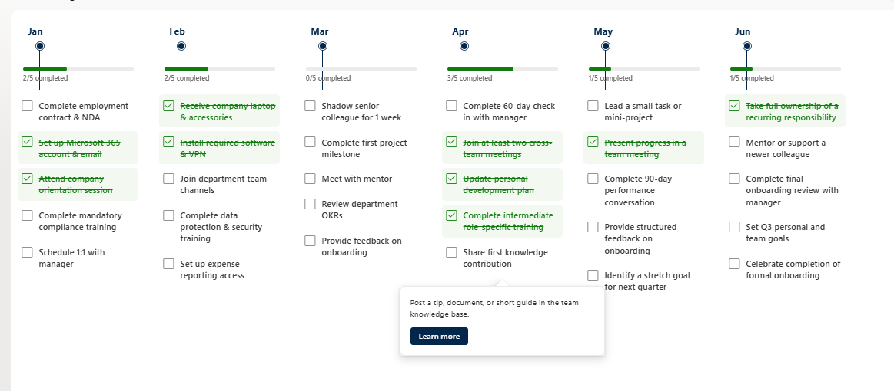

# Key Dates Timeline Checklist

## Summary
A modern horizontal timeline view that displays key dates or milestones as monthly columns. Each month shows a progress bar and up to 5 checklist items that users can mark as completed directly in the view. Hovering over an item reveals additional details and an optional "Learn more" link.

Perfect for onboarding journeys, project milestones, compliance tracking, or any process that spans multiple months.

## View requirements

| Type | Internal Name | Required | Notes |
|------|---------------|----------|-------|
| Single line of text | Month | Yes | e.g. January 2026, February 2026 |
| Single line of text | Process1 | No | |
| Multiple lines of text | Process1Details | No | Shown in the hover card |
| Hyperlink | Process1Link | No | Optional "Learn more" link |
| Choice | Process1Status | Yes | Values: `Completed`, `Not started` |
| Single line of text | Process2 | No | |
| Multiple lines of text | Process2Details | No | |
| Hyperlink | Process2Link | No | |
| Choice | Process2Status | Yes | Values: `Completed`, `Not started` |
| Single line of text | Process3 | No | |
| Multiple lines of text | Process3Details | No | |
| Hyperlink | Process3Link | No | |
| Choice | Process3Status | Yes | Values: `Completed`, `Not started` |
| Single line of text | Process4 | No | |
| Multiple lines of text | Process4Details | No | |
| Hyperlink | Process4Link | No | |
| Choice | Process4Status | Yes | Values: `Completed`, `Not started` |
| Single line of text | Process5 | No | |
| Multiple lines of text | Process5Details | No | |
| Hyperlink | Process5Link | No | |
| Choice | Process5Status | Yes | Values: `Completed`, `Not started` |

> **Tip**: Create the Choice columns with the exact values `Completed` and `Not started`.

## Sample data

| Month | Process1 | Process1Status | Process2 | Process2Status | Process3 | Process3Status | Process4 | Process4Status | Process5 | Process5Status |
|-------|----------|----------------|----------|----------------|----------|----------------|----------|----------------|----------|----------------|
| January 2026 | Complete employment contract & NDA | Completed | Set up Microsoft 365 account & email | Completed | Attend company orientation session | Not started | Complete mandatory compliance training | Not started | Schedule 1:1 with manager | Not started |
| February 2026 | Receive company laptop & accessories | Completed | Install required software & VPN | Completed | Join department team channels | Not started | Complete data protection & security training | Not started | Set up expense reporting access | Not started |
| March 2026 | Shadow senior colleague for 1 week | Not started | Complete first project milestone | Not started | Meet with mentor | Not started | Review department OKRs | Not started | Provide feedback on onboarding | Not started |
| April 2026 | Complete 60-day check-in with manager | Not started | Join at least two cross-team meetings | Completed | Update personal development plan | Completed | Complete intermediate role-specific training | Completed | Share first knowledge contribution | Not started |
| May 2026 | Lead a small task or mini-project | Not started | Present progress in a team meeting | Completed | Complete 90-day performance conversation | Not started | Provide structured feedback on onboarding | Not started | Identify a stretch goal for next quarter | Not started |
| June 2026 | Take full ownership of a recurring responsibility | Completed | Mentor or support a newer colleague | Not started | Complete final onboarding review with manager | Not started | Set Q3 personal and team goals | Not started | Celebrate completion of formal onboarding | Not started |

## Features
- Horizontal monthly timeline layout
- Progress bar per month (X/5 completed)
- Clickable checklist items with toggle (Completed ↔ Not started)
- Hover cards with details and optional "Learn more" link
- Visual feedback (green checkmark, strikethrough, and background highlight)
- Clean and modern design

## Solution

| Solution | Author(s) |
|----------|-----------|
| key-dates-timeline-checklist.json | [Anand Ragav](https://github.com/anandragav) |

## Version history

| Version | Date | Comments |
|---------|------|----------|
| 1.0 | July 28, 2026 | Initial release |

## Additional notes
- Designed for Microsoft Lists / SharePoint modern experience
- Best viewed on desktop
- Works with both SharePoint lists and Microsoft Lists

