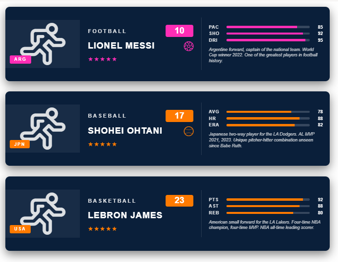

# Sports Card

## Summary

This SharePoint JSON view formatting sample transforms list items into landscape sports trading cards inspired by FIFA / NBA-style collectibles, sized to fit cleanly in a standard List view row (~170 px tall). Each card has a player silhouette panel with country badge on the left, a sport name / jersey number / player name / star rating column in the middle, and three labelled stat bars plus a short description on the right.

It's designed for player rosters, team directories, character lists, or any "collectible" style list.

## View requirements

### Recommended SharePoint List Columns

| Column Name       | Internal Name   | Type                  | Description                                                                  |
| ----------------- | --------------- | --------------------- | ---------------------------------------------------------------------------- |
| Title             | Title           | Single line of text   | Player full name (shown in the name band, uppercase)                         |
| Sport             | Sport           | Single line of text   | Sport / league label shown in the header (e.g. `FOOTBALL`, `BASEBALL`)       |
| Jersey Number     | JerseyNumber    | Number                | Jersey number shown in the accent-coloured header badge                      |
| Country           | Country         | Single line of text   | Country code shown in the top-right badge (e.g. `ARG`, `JPN`, `USA`)         |
| Rating            | Rating          | Single line of text   | Star glyphs (e.g. `★★★★★`)                                                  |
| Description       | Description     | Multiple lines of text| Short paragraph shown at the bottom of the card                              |
| Stat 1 Label      | Stat1Label      | Single line of text   | Short label for stat 1 (e.g. `PAC` for pace, `AVG` for batting average)      |
| Stat 1 Value      | Stat1Value      | Number                | Value for stat 1 — `0 - 100` (drives the bar fill width)                     |
| Stat 2 Label      | Stat2Label      | Single line of text   | Short label for stat 2                                                       |
| Stat 2 Value      | Stat2Value      | Number                | Value for stat 2 — `0 - 100`                                                 |
| Stat 3 Label      | Stat3Label      | Single line of text   | Short label for stat 3                                                       |
| Stat 3 Value      | Stat3Value      | Number                | Value for stat 3 — `0 - 100`                                                 |
| Accent Color      | AccentColor     | Single line of text   | Hex for the header badge, country badge, name band, stat bars (e.g. `#ff2db5`) |
| Background Color  | BackgroundColor | Single line of text   | Hex for the card background (e.g. `#0a1f3a` dark navy)                       |
| Player Icon       | PlayerIcon      | Single line of text   | Fluent UI icon name for the large silhouette (e.g. `Running`, `Contact`)     |
| Sport Icon        | SportIcon       | Single line of text   | Fluent UI icon name shown next to the player name (e.g. `Trophy`, `Soccer`)  |

A PowerShell script has been provided in the [assets](./assets/Create%20List.ps1) folder to provision the list for you. The script also seeds 3 sample cards (soccer, baseball, basketball) covering the visual variety in the design.

**Note:** This script uses [PnP PowerShell](https://pnp.github.io/powershell/) and requires an environment ready for PnP PowerShell.

## Sample

Solution|Author
--------|---------
sports-card.json | [Sudeep Ghatak](https://github.com/sudeepghatak) ([LinkedIn](https://www.linkedin.com/in/sudeepghatak/))

## Version history

Version|Date|Comments
-------|----|--------
1.0|July 23, 2026|Initial release

## Disclaimer

**THIS CODE IS PROVIDED *AS IS* WITHOUT WARRANTY OF ANY KIND, EITHER EXPRESS OR IMPLIED, INCLUDING ANY IMPLIED WARRANTIES OF FITNESS FOR A PARTICULAR PURPOSE, MERCHANTABILITY, OR NON-INFRINGEMENT.**

---

## Additional notes

- **Colours are column-driven.** Both `BackgroundColor` and `AccentColor` are read directly via `[$BackgroundColor]` / `[$AccentColor]`. This avoids unreliable nested `if()` expressions in style values and lets you re-skin per card without editing the JSON.
- **Icons are column-driven too.** Both `PlayerIcon` (the large central silhouette) and `SportIcon` (the small glyph next to the player name) use `iconName: "[$ColumnName]"`. Pick any name from the Fluent UI v1 set that ships with SharePoint - common options include `Running`, `Contact`, `Trophy`, `Soccer`, `Basketball`, `Baseball`. If a chosen icon doesn't render in your tenant, swap it for a safe default like `Trophy` or `Running`.
- **Stat bars** are computed with `=toString([$StatNValue]) + '%'`. Store integers `0 - 100` and each bar fills proportionally.
- **Rating** is stored as plain text so you can paste any star sequence (`★★★★★`, `★★★★☆`, etc.).
- **Card orientation is landscape** (740 px max-width, 170 px min-height) so the whole card fits in a single standard List view row. If you'd rather have the portrait FIFA-style look from the original inspiration image, switch the list to a Gallery / Tiles view and use the portrait variant of the JSON.

